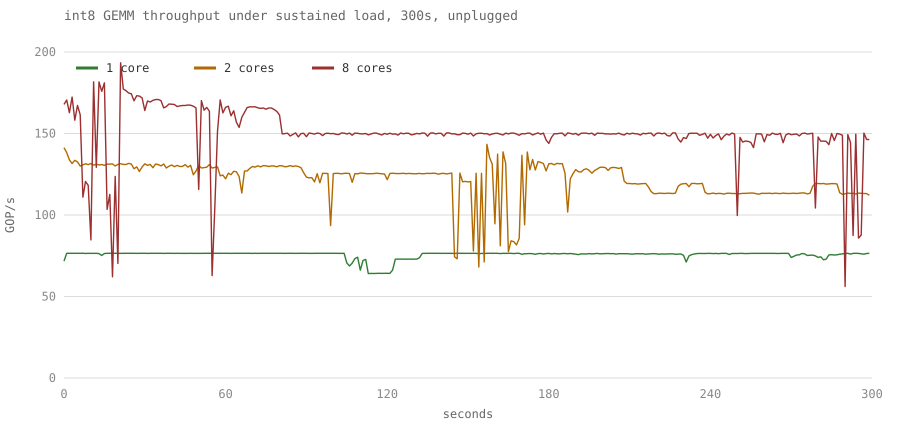

# arm-quant-gemm

Int8 matrix multiply on a phone, seven ways, plus what it costs to hand the
answer back as int8. Measured properly.

Four things it found. The first is that hand-written NEON can be slower than
plain C:

```
Cortex-A55 (in-order little core)
  auto_vec        4.79 GOP/s     plain C, compiler auto-vectorized
  neon_smull      4.76 GOP/s     hand-written NEON intrinsics
```

The intrinsics are not wrong. They use one accumulator, so every iteration waits
on the one before it. The compiler used eight and did not wait.

The second is that fixing that is not where most of the performance was. Four
accumulators take the A78 from 44.02 to 76.31 GOP/s, and then loading each byte
once and using it four times takes it to 111.68, on the same instruction:

```
Cortex-A78, same sdot arithmetic throughout
  neon_sdot       44.02 GOP/s   one accumulator
  neon_sdot_x4    76.31 GOP/s   four accumulators          1.73x
  neon_sdot_m4   111.68 GOP/s   four rows share each load  1.46x more
```

The kernel was never short of arithmetic. It was short of operands, and the
measurement that shows it is in [How much of the core is
that](#how-much-of-the-core-is-that).

The third is that a burst measurement overstates what the phone sustains, by
29% with all eight cores loaded:

```
8 cores, 300s under load
  best single second   193.4 GOP/s
  steady state         149.8 GOP/s     reached after 81s
```

The fourth is that requantizing the accumulator back to int8, which every real
quantized layer has to do, is a fixed cost per output. What it costs you is
therefore a question about K and nothing else:

```
Cortex-A78, neon_sdot_m4, int32 accumulator against int8 output
  K=1024   109.49 -> 95.87 GOP/s    -12%
  K=32      54.09 -> 29.38 GOP/s    -46%
```

A benchmark that stops at int32 quotes a number no quantized model ever sees.

## Results

Galaxy A14 5G, Exynos 1330, Android 15, six Cortex-A55 plus two Cortex-A78.
M=64, N=64, K=1024, int8 accumulating into int32. Median of accepted
repetitions, device unplugged from USB. Produced by `run.sh`, raw output in
[results/](results/).

| kernel | A55 GOP/s | A78 GOP/s | what it is |
|---|---|---|---|
| `scalar` | 0.79 | 3.92 | C, vectorizer off |
| `auto_vec` | 4.79 | 18.55 | same C, vectorizer on |
| `neon_smull` | 4.76 | 29.60 | intrinsics, one accumulator |
| `neon_smull_x4` | 5.50 | 32.39 | intrinsics, four accumulators |
| `neon_sdot` | 8.04 | 44.02 | ARMv8.2 dot product, one accumulator |
| `neon_sdot_x4` | 8.94 | 76.31 | dot product, four accumulators |
| `neon_sdot_m4` | **15.53** | **111.68** | four rows of A share each B load |

Every row above writes int32. What it costs to finish the job and write int8 is
its own measurement with its own conditions, in [What requantization
costs](#what-requantization-costs).

## What the numbers say

**Against the right baseline the win is 6.0x, not 28.5x.** `neon_sdot_m4` is
28.5x faster than scalar C on the A78. That figure is close to meaningless,
because nobody ships scalar C: the compiler vectorizes it for you. Against what
you actually get for free it is 6.0x. A benchmark quoting the first number is
comparing against code no one would have written.

This is why `scalar` and `auto_vec` are one source file compiled twice, once
with `-fno-vectorize`. It was not the original plan. The first `scalar` kernel
turned out to emit 24 SIMD instructions at `-O3`, so an honest baseline had to
be built deliberately rather than assumed.

**Four accumulators helps the big core more than the little one**, which is the
opposite of the intuition that in-order cores need the hand-holding:

| | one accumulator | four | gain |
|---|---|---|---|
| A55 `sdot` | 8.04 | 8.94 | 1.11x |
| A78 `sdot` | 44.02 | 76.31 | 1.73x |

Arm's optimization guides say why, and the reason is not issue order. Both
cores forward an accumulator between consecutive dot products at a latency of
one cycle. What differs is how many dot products each can start per cycle:

| | `SDOT` throughput, Q-form | accumulate latency | one chain saturates it? |
|---|---|---|---|
| A55 | 1 per cycle | 1 cycle | **yes** |
| A78 | 2 per cycle | 1 cycle | no, it fills half |

One accumulator issues at most one dot product per cycle, because the next one
waits a cycle for the forwarded accumulator. On the A55 that already matches
what the core can start, so a second chain has nowhere to go and the gain is
1.11x. On the A78 it leaves half the machine idle, and independent chains
collect the rest: 1.73x measured against 2x available.

The A55 number carries a footnote that is easy to miss. Its table lists a
throughput of 2, but note 1 says the Q-form, which is the 128-bit form these
kernels use, "can only be dual issued as instruction 0 and execution throughput
is 1". Reading the headline number would have predicted a gain that is not
there.

Sources: [Cortex-A78 Software Optimization
Guide](https://developer.arm.com/documentation/102160/latest/) r1p2 issue 5.0,
`ASIMD dot product` on page 34 and the accumulator forwarding note on page 19;
[Cortex-A55 Software Optimization
Guide](https://documentation-service.arm.com/static/6385cb83ff39817c1136abd8)
r2p0 issue 4.0, page 35.

**`sdot` earns its keep.** Over the four-accumulator `smull` kernel it is 1.63x
on the A55 and 2.36x on the A78. It is detected at runtime through `AT_HWCAP`,
and skipped rather than crashing on a core without it.

## How much of the core is that

Being 6.0x faster than the compiler says nothing about how much of the silicon
is left unused. The dot product throughput above gives a ceiling to measure
against.

A `SDOT Vd.4S, Vn.16B, Vm.16B` performs 4 lanes of 4 int8 multiply-accumulates,
so 16 MACs, counted here as 32 operations to match the `2 * M * N * K` the
benchmark reports. Peak is then throughput times 32 times the clock, and the
clock is not the nominal one: every repetition that ran below the cluster's
peak is discarded before the median, so the surviving repetitions ran at the
frequency in the results header.

| | peak | `neon_sdot` | `neon_sdot_x4` | `neon_sdot_m4` |
|---|---|---|---|---|
| A55 at 2002 MHz | 64.1 GOP/s | 8.04, 12.5% | 8.94, 14.0% | 15.53, **24.2%** |
| A78 at 2400 MHz | 153.6 GOP/s | 44.02, 28.7% | 76.31, 49.7% | 111.68, **72.7%** |

Four accumulators land the A78 at almost exactly half of peak, which is what one
dot product per cycle looks like on a core that can start two. So the
accumulators did their job and something else became the limit.

It was operand delivery, and `neon_sdot_m4` is the experiment that shows it. It
runs four rows of A against one vector of B, so each B load feeds four dot
products instead of one. Same instruction, same arithmetic, same accumulator
count. Counted in the emitted inner loop, the ratio goes from 2.00 loads per
`sdot` to 1.25, and throughput goes up 1.46x on the A78 and 1.74x on the A55.

The quantity that stays put is not dot products per cycle, it is bytes per
cycle:

| | loads per `sdot` | `sdot` per cycle | bytes per cycle |
|---|---|---|---|
| A55 `neon_sdot_x4` | 2.00 | 0.140 | 4.5 |
| A55 `neon_sdot_m4` | 1.25 | 0.244 | 4.9 |
| A78 `neon_sdot_x4` | 2.00 | 0.994 | 31.8 |
| A78 `neon_sdot_m4` | 1.25 | 1.456 | 29.1 |

Each core holds a roughly constant load bandwidth across both kernels, and the
throughput falls out of how many dot products you get per byte. The A78's 30ish
bytes per cycle is two 16-byte loads, even though its table lists three load
pipes and a vector load throughput of 3. Issue slots were never the binding
constraint; delivered bytes were.

This is also why the two cores gain differently from the same change. The A78's
bandwidth dipped slightly between the two kernels and it gained 1.46x, less than
the 1.60x the load ratio alone would predict. The A55's rose slightly and it
gained 1.74x, more.

The A55 remains at 24.2% of its own peak, so the blocking closed part of its gap
and not the rest. That one is still open.

These ceilings apply only to the `sdot` kernels. Applying them to the `smull`
kernels would be wrong, since they issue a different instruction with different
throughput.

## What requantization costs

Every kernel above stops at int32. That is the arithmetic core of a quantized
layer and not the whole operator: the next layer wants int8 back, and getting
there is a fixed point multiply, a rounding shift, a zero point and a
saturating narrow, per output element. `q_sdot_m4` is the same matmul with that
epilogue fused, and `q_sdot_m4_se` is the same again with the epilogue left
scalar.

Cortex-A78 at 2400 MHz, M=N=64, one core, unplugged. Raw output in
[results/requant_a78.csv](results/requant_a78.csv).

This sweep uses far more repetitions than the table above, because a single
fast kernel run on its own finishes in a few milliseconds and the governor
never leaves its idle frequency: at 50 repetitions the filters reject 47 of
them as downclocked and there is no result at all. The repetition count is
scaled by K so every column does comparable work. It is a separate run, so the
K=1024 baseline here reads 109.49 against the 111.68 above, which is the run to
run spread the rest of this README warns about.

| K | int32 out | int8, vector epilogue | int8, scalar epilogue |
|---|---|---|---|
| 1024 | 109.49 | 95.87 (**-12%**) | 88.88 (-19%) |
| 512 | 109.16 | 85.66 (-22%) | 74.80 (-31%) |
| 256 | 102.50 | 68.33 (-33%) | 54.42 (-47%) |
| 128 | 92.73 | 59.14 (-36%) | 38.34 (-59%) |
| 64 | 74.49 | 42.60 (-43%) | 22.87 (-69%) |
| 32 | 54.09 | 29.38 (**-46%**) | 12.88 (-76%) |

**The epilogue is a fixed cost per output, so what it costs you is entirely a
question of K.** Differencing the two times puts the scalar epilogue at 3.8 to
4.4 ns per output across the whole sweep, a 32x range of K. The matmul feeding
it grows with K and the epilogue does not, so the same work is 12% of
throughput at K=1024 and 46% at K=32.

A benchmark that stops at int32 quotes the left column for a model that only
ever sees one of the others.

**Vectorizing the epilogue is worth more the smaller K gets**: 1.6x at K=1024
against 3.8x at K=32. That one is not the fixed cost again. The scalar epilogue
holds nearly flat across the sweep, 4.34 down to 3.78 ns, while the vector one
falls to a third, 2.66 down to 1.00, and a measured cost that moves like that is
what the next paragraph is about.

The fixed cost model is exact on the little core and only roughly true on the
big one:

| | scalar epilogue, ns per output | vector |
|---|---|---|
| A55, in-order | 18.5 to 19.6 | 3.9 to 5.1 |
| A78, out-of-order | 3.8 to 4.4 | 1.0 to 2.7 |

The A55 numbers barely move and vectorizing buys 3.9x to 4.7x, which is the lane
count.
On the A78 the vector epilogue's apparent cost more than halves between K=1024
and K=32, and a fixed cost cannot do that. The subtraction is what breaks, not
the kernel: an out-of-order core overlaps the epilogue with the matmul ahead of
it, so the two times do not simply add. Where they do add, in order, the model
holds.

One result that reads backwards. Quantizing costs *less* on the slower core at
large K: 3.7% on the A55 against 12.4% on the A78 at K=1024. Both of those are
the vector epilogue, which is about twice as expensive on the A55 in absolute
terms, 5.05 ns against 2.66. Its matmul is seven times slower, and only the
ratio reaches the output.

## Correctness of the epilogue

The requantization follows TFLite's convention, which is what an exported int8
model carries: weights per output channel and symmetric, activations per tensor
with a zero point, and the scale as a Q31 multiplier plus a shift so the whole
epilogue stays in integer arithmetic.

The activation zero point never appears in the inner loop, because it does not
have to. `sum((a - za) * w)` is `sum(a * w)` minus `za * sum(w)`, and the second
term depends only on the weights, so it is a per channel constant folded into
the bias once. Leaving the zero point out of a benchmark would not make the
benchmark faster, only less like the thing it claims to measure.

One instruction is not the translation it looks like. `vrshlq_s32` rounds a tie
up and gemmlowp's `RoundingDivideByPOT` rounds it away from zero, so they
disagree on exactly the negative values landing on one. Removing the fixup that
reconciles them makes `q_sdot_m4` disagree with the scalar reference on this
benchmark's own data while `q_sdot_m4_se` stays correct, which is how it was
found and what says the check is worth having.

## Sustained load is a different question

A burst of 50 repetitions on one core says 111.68 GOP/s, and that is true. It is
also not what the phone delivers. Each row below is 300 seconds of continuous
work, unplugged, summarised by `analyze.sh`:

| load | behaviour | sustained | best single second | thermal status |
|---|---|---|---|---|
| 1 core | settles at 2400 MHz in 1s | 76.5 | 76.5 (1.00x) | 0, never throttled |
| 2 cores | never settles | 113.4 late, drifting -12.6% | 143.4 (1.26x) | 1 |
| 8 cores | settles in 81s at 1920/1536 MHz | 149.8 | 193.4 (1.29x) | 2 |

The three rows are three different behaviours, not three points on one curve.



The picture is the argument. One core draws a flat line. Two cores draw a line
that keeps sagging. Eight cores start highest, fall off a cliff at 80 seconds,
and then hold a level that is only a little above where two cores ended up,
with the occasional second where the governor takes most of it away.

The chart is generated by `plot.sh` from the same CSVs `analyze.sh` reads, and
CI regenerates it and fails if the committed file differs, so it cannot drift
away from the numbers it is drawn from.

**One core runs flat forever.** It holds 2400 MHz for the whole five minutes and
Android never reports throttling. Anything that fits on one core is not a
thermal problem on this device.

**Two cores never reach a steady state.** The governor hunts between 1824 and
2112 MHz for the entire run, and throughput drifts down 12.6% from the first
hundred seconds to the last without ever settling. Quoting a single number for
this case would be inventing one.

**Eight cores settle, and settle low.** After 81 seconds the clocks pin at 1920
MHz on the A55s and 1536 MHz on the A78s, which is 64% of the A78 peak, and
throughput sits at 149.8 GOP/s with a p5 to p95 band of 144.6 to 150.3. From
there it does not move.

Picking the window changes the answer here, which is why `analyze.sh` looks for
the DVFS operating point the run actually converges to rather than comparing the
first seconds against the last. An earlier draft of this README did compare the
ends, and reported a 25.9% drop for the eight core case that was an artefact of
catching the tail during a one second dip.

Those dips are real and are left in the raw data. Sustained mode reports
throughput per second with no filtering, so a second where Android decided to do
something else shows up as a 56 GOP/s sample. The burst mode filters described
below do not apply here on purpose: this measurement is meant to include the
phone being a phone.

The throttling level comes from Android's `thermalservice` rather than from a
temperature reading. The thermal zones under `/sys/class/thermal` are root-only
on a retail phone, and battery temperature lags the SoC badly: it moved 2.9 C
across all of this while the A78 clock was being cut by more than a third.

## How it is measured

A phone is a hostile place to benchmark. Three things corrupt a result, and each
is detected rather than hoped away.

**The scheduler moves you.** Six A55s and two A78s. An unpinned run migrates
between them mid-measurement and reports the mixture. Every run pins to one CPU,
and a run without `--cpu` says so in its output.

**The governor changes frequency underneath you.** This device runs
`energy_aware`, and the governor cannot be changed without root. So every
repetition records `scaling_cur_freq` before and after itself, outside the timed
window. A repetition whose frequency moved, or that ran below the cluster's
peak, is discarded and counted.

**Other processes steal your core.** Every repetition records both
`CLOCK_MONOTONIC` and `CLOCK_THREAD_CPUTIME_ID`. When wall time runs more than
2% ahead of CPU time the thread was descheduled, and the repetition is thrown
out.

The output says how many survived and why the rest did not:

```
neon_sdot_m4   median   0.075 ms  p10   0.075  p90   0.075  111.68 GOP/s  spread  1.2%  kept 49/50  (preempt 1, dvfs 0, slow 0)
scalar         median   2.139 ms  p10   2.133  p90   2.147    3.92 GOP/s  spread  0.6%  kept 27/50  (preempt 1, dvfs 9, slow 13)
```

That second line is the point. Half the scalar repetitions ran at the wrong
clock, and nothing except the filter would have said so.

None of this is cosmetic. Before the filters existed the same measurements
spread 135% to 2102% between fastest and slowest repetition, and even reporting
the minimum understated the A78 dot product kernel by 27%, because entire series
had run below peak frequency with no sign of it in the output. After the filters
the spread is 0.2% to 3.0%.

Results are medians of surviving repetitions with p10 and p90, never means. On a
phone the tail is thermal and scheduling noise, and a mean folds it into the
answer.

Run to run, the numbers here move by up to 4%. Two independent full runs of
`run.sh` put A78 `neon_sdot_x4` at 76.31 and 76.34 GOP/s. Treat the ratios
between kernels as the result, not the third digit.

## Reproducing

Needs the Android NDK and a device on `adb`. For the sustained runs the device
must be off USB power, because charging heats it:

```sh
adb tcpip 5555 && adb connect <device-ip>:5555   # then unplug
sh run.sh
```

`run.sh` builds, pushes, checks correctness, measures both core types, runs the
three sustained scenarios with thermal sampling, and writes everything to
`results/`. It warns if the device is still plugged in.

To build alone:

```sh
sh build.sh                            # $ANDROID_NDK_HOME or $ANDROID_HOME/ndk
CC=aarch64-linux-gnu-gcc sh build.sh   # any aarch64 cross compiler
```

Only `gemm_neon_sdot.c` is compiled with `+dotprod`. Building everything with it
would let the compiler reach for `sdot` inside the baseline kernels, and the
comparison would mean nothing.

## Correctness

Every kernel is checked before it is timed and one that disagrees is reported
instead of measured. There are two references, both built with the vectorizer
off: `gemm_scalar` for the kernels that write int32 and `gemm_q_scalar` for the
ones that write int8. CI cross-compiles for aarch64 and runs the checks under
qemu, including K=253 so the tail paths past the 16, 32 and 64 byte loop bodies
are exercised, and asserts on the emitted code that neither reference contains a
vector instruction.

CI deliberately publishes no timings. A timing under emulation is a timing of
the emulator.

## Scope

**One device.** Every number is from one Exynos 1330. Cortex-A55 and Cortex-A78
are common enough that the shape should carry, but the ratios are not a claim
about ARM in general.

**No i8mm.** This SoC reports `asimddp` but not `i8mm`, so the 8-bit matrix
multiply path is absent rather than untested.

**Blocking stops at one dimension.** `neon_sdot_m4` blocks M by four and that is
the whole of it. Nothing blocks N or K, nothing packs either operand, and
nothing tiles for a cache level. A real inference kernel does all of those, so
the 72.7% of peak below is not a claim about how close this is to a production
GEMM.

**One quantization scheme.** Per output channel weights, per tensor activations
with a zero point, int8 in and int8 out, which is what TFLite exports. No per
tensor weight variant, and the output clamp is the full int8 range rather than a
fused ReLU, so nothing here measures what folding an activation into the
epilogue would save.

**B is stored transposed** as N rows of K, so every kernel walks both operands
contiguously. Comparing kernels that disagree about layout would measure the
layout.
